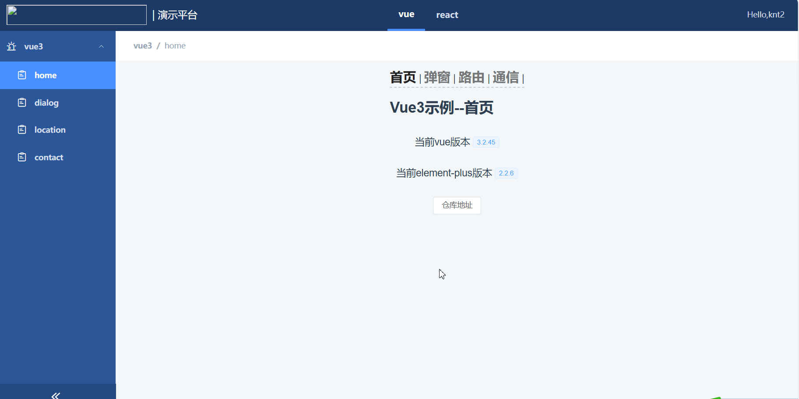
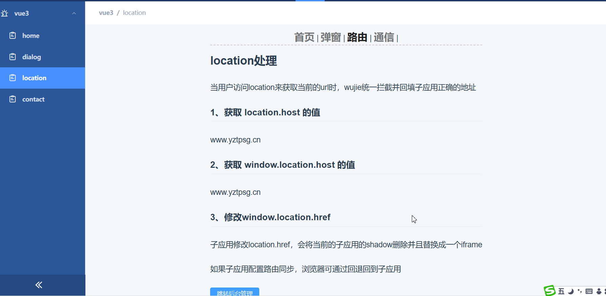
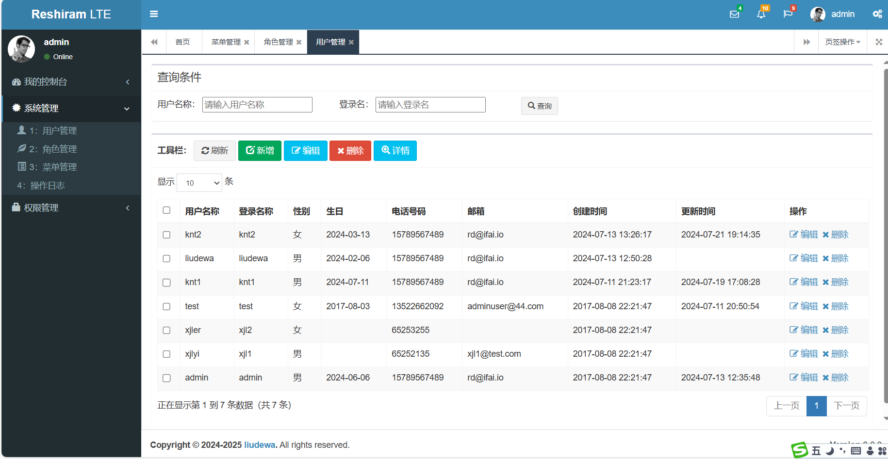
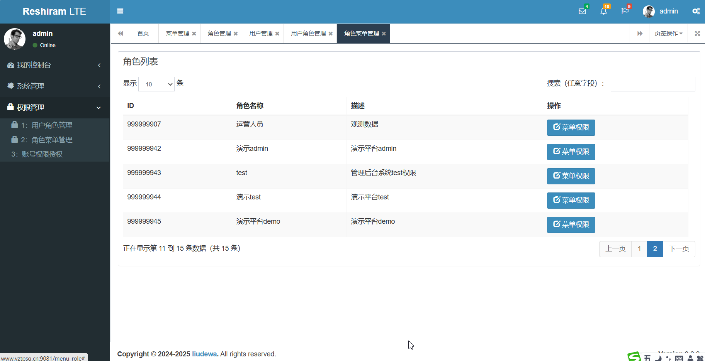

# integration-platform(微前端-多系统集成)
- 前端: 采用微前端框架[无界](https://wujie-micro.github.io/doc/),实现了多系统动态集成, 菜单动态展示
- 管理端: 权限管理，用户管理，菜单管理, 用户角色管理, 角色菜单管理
## framework-fe(前端)
### 演示demo
- [地址](http://www.yztpsg.cn/integration/)
- 账号: knt2 密码: 123
#### 效果图
- 
- 
### 技术
- [无界](https://wujie-micro.github.io/doc/) + vue3 + vite + element-plus

### 已完成
- [X] 多系统集成
- [X] 系统动态展示
- [x] 菜单动态展示

## management-be(后台管理)
### 演示demo
- [地址](http://www.yztpsg.cn:9081/)
- 账号: test 密码: test(账号,只有分配权限)
#### 效果图
- 
- 
### 技术
- 基于[express-admin](https://github.com/wangbinlml/express-admin)进行修改使用,技术比较老

### 已完成
- [X] 用户登录
- [X] 用户管理
- [x] 菜单管理
- [x] 权限管理
- [x] 用户角色管理
- [x] 角色菜单管理

## server-be(后端接口)
### 接口代理地址
- [地址](http://www.yztpsg.cn/integration)
### 技术
- node + express + mysql
### 已完成接口
- [X] 登录
- [X] 获取菜单